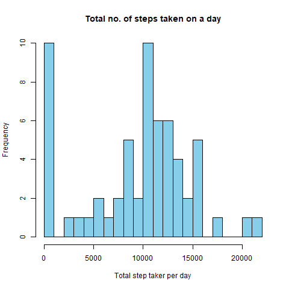
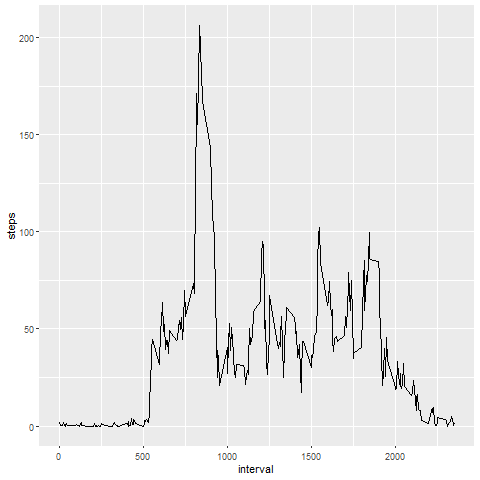
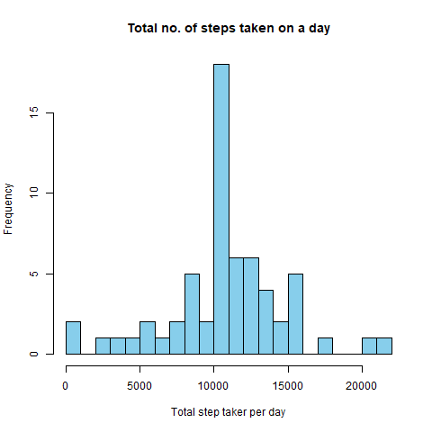
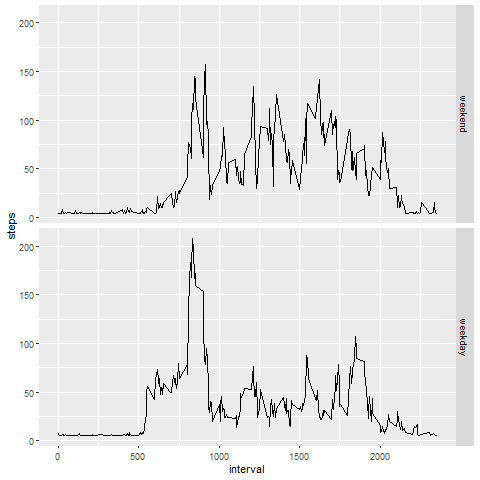

# Reproducible Research: Peer Assessment 1

## Data
The data for this assignment can be downloaded from the course web site:

* Dataset: Activity monitoring data [52K] (https://d396qusza40orc.cloudfront.net/repdata%2Fdata%2Factivity.zip)

The variables included in this dataset are:

* steps: Number of steps taking in a 5-minute interval (missing values are coded as NA)

* date: The date on which the measurement was taken in YYYY-MM-DD format

* interval: Identifier for the 5-minute interval in which measurement was taken

The dataset is stored in a comma-separated-value (CSV) file and there are a total of 17,568 observations in this dataset.

## Assignment

Set to show R code.

```{r}
library(knitr)
opts_chunk$set(echo=TRUE)
```

## Loading and preprocessing the data

```{r, echo=TRUE, message=FALSE}
library(ggplot2)
library(dplyr)
```

**Load the data**
```{r, echo=TRUE}
fileurl <- 'https://d396qusza40orc.cloudfront.net/repdata%2Fdata%2Factivity.zip'
if(!file.exists('activity.csv')) {
        download.file(fileurl, 'zipfile.zip', method='curl')
        unzip('zipfile.zip')
        file.remove('zipfile.zip')
}
activity <- read.csv('activity.csv')
```

**Process/transform the data (if necessary) into a format suitable for your analysis**
```{r, echo=TRUE}
activity <- read.csv('activity.csv')
str(activity)
activity$date <- as.Date(activity$date, '%Y-%m-%d')
```


## What is mean total number of steps taken per day?
_____________________________________________________

**Calculate the total number of steps taken per day**
```{r, echo=TRUE}
daysteps <- tapply(activity$steps, activity$date, sum, na.rm=T)
```

**Make a histogram of the total number of steps taken each day**
```{r, echo=TRUE}
hist(daysteps, breaks = 20, col = "sky blue",
     xlab = "Total step taker per day",main = "Total no. of steps taken on a day")
```

**Calculate and report the mean and median of the total number of steps taken per day**
```{r, echo=TRUE}
meanvalue <- mean(daysteps)
medianvalue <- median(daysteps)
```
```
## [1] 9354.23
## [2] 10395
```


Mean: `r meanvalue`, Median:`r medianvalue`

## What is the average daily activity pattern?
___________________

**Make a time series plot of the 5-minute interval (x-axis) and the average number of steps taken, averaged across all days (y-axis)**
```{r, echo=TRUE}
average_steps <- activity %>% filter(!is.na(steps)) %>% group_by(interval) %>% 
        summarize(steps = mean(steps))
average_steps %>% ggplot(aes(x=interval, y=steps, group=1)) + geom_line()
```


**Which 5-minute interval, on average across all the days in the dataset, contains the maximum number of steps?**
```{r, echo=TRUE}
max_steps <- average_steps[which.max(average_steps$steps), ][[1]]
```
```
## [1] 835
```
The interval `r max_steps` has the maximum steps

## Imputing missing values
__________________________
**Calculate and report the total number of missing values in the dataset**
```{r, echo=TRUE}
miss <- sapply(activity, is.na) %>% sum
```
```
##[1] 2304
```
Number of missing values: `r miss`

**Devise a strategy for filling in all of the missing values in the dataset. The strategy does not need to be sophisticated. For example, you could use the mean/median for that day, or the mean for that 5-minute interval, etc.**

We'll fill in the missing values with the `steps` mean

**Create a new dataset that is equal to the original dataset but with the missing data filled in.**
```{r, echo=TRUE}
steps_complete <- activity$steps
steps_complete[is.na(steps_complete)] <- round(mean(activity$steps, na.rm = T), digits=0)
steps_complete <- as.numeric(steps_complete)
activity_complete <- cbind.data.frame(steps_complete, activity$date, activity$interval)
colnames(activity_complete) <- colnames(activity)
```

**Make a histogram of the total number of steps taken each day**
```{r, echo=TRUE, message=FALSE}
daysteps_complete <- tapply(activity_complete$steps, activity_complete$date, sum)
hist(daysteps_complete, breaks = 20, col = "sky blue",
     xlab = "Total step taker per day",main = "Total no. of steps taken on a day")
```

**Calculate and report the mean and median total number of steps taken per day. Do these values differ from the estimates from the first part of the assignment? What is the impact of imputing missing data on the estimates of the total daily number of steps?**
```{r, echo=TRUE}
mean_complete <- mean(daysteps_complete)
median_complete <- median(daysteps_complete)
```
```
##[1] 10751.74
##[2] 10656
```
Mean: `r mean_complete`, Median: `r median_complete`

The mean and median values differ from those which were calculated with `NAs`. The values became greater

## Are there differences in activity patterns between weekdays and weekends?
___________________
**Create a new factor variable in the dataset with two levels - "weekday" and "weekend" indicating whether a given date is a weekday or weekend day.**
```{r, echo=TRUE}
weekd <-c('Monday', 'Tuesday', 'Wednesday', 'Thursday', 'Friday')
activity_complete$weekdayz <- factor((weekdays(activity_complete$date) %in% weekd),
                                     levels = c(FALSE, TRUE), labels = c('weekend', 'weekday'))
```
**Make a panel plot containing a time series plot of the 5-minute interval (x-axis) and the average number of steps taken, averaged across all weekday days or weekend days (y-axis).**
```{r, echo=TRUE}
average_steps_complete <- activity_complete %>% group_by(interval, weekdayz) %>%
        summarise(steps = mean(steps))
average_steps_complete %>% ggplot(aes(x=interval, y=steps, group=1)) +
        geom_line() + 
        facet_grid(weekdayz~.)
        
```

